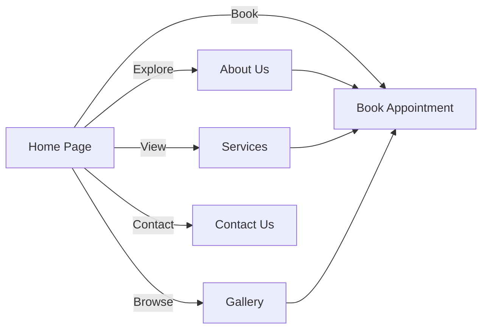

## 1. Product Overview
Premium automotive service website for P.M. Automobile Works, established in 1978. Provides complete auto care solutions with a modern, luxurious interface similar to high-end automotive brands. Target users are car owners seeking professional, reliable vehicle maintenance and repair services.

## 2. Core Features
### 2.1 User Roles
| Role | Registration Method | Core Permissions |
|------|---------------------|------------------|
| Normal User | No registration required | Browse services, book appointments, view gallery, contact business |

### 2.2 Feature Module
1. **Home Page**: Hero section, statistics, about preview, services grid, why choose us, gallery preview, CTA, footer
2. **About Us Page**: Hero banner, company story, history timeline, mission/vision/core values, workshop overview, statistics, brands we service
3. **Services Page**: Hero banner, 12-service grid, CTA
4. **Gallery Page**: Hero, filter buttons, masonry image grid, hover zoom, lightbox
5. **Book Appointment Page**: Booking form (customer details, vehicle details, date/time/service, notes), summary card
6. **Contact Page**: Hero banner, contact info, business hours, map, contact form

### 2.3 Page Details
| Page Name | Module Name | Feature description |
|-----------|-------------|---------------------|
| Home | Hero Section | Large workshop image with dark overlay, headline, primary/secondary buttons |
| Home | Statistics Bar | Animated counters for years in business, vehicles serviced, etc. |
| About | Company Story | Detailed narrative of P.M. Automobile Works history since 1978 |
| Services | Service Grid | 12 service cards with icons, descriptions, hover effects |
| Gallery | Filter Buttons | Filter images by category, masonry layout |
| Book Appointment | Booking Form | React Hook Form validation, multi-section form with summary |
| Contact | Google Map | Embedded interactive map |

## 3. Core Process
User visits website → browses services or about us → views gallery → books appointment or contacts business.

## 4. User Interface Design
### 4.1 Design Style
- **Primary Color**: Navy (#0F172A), Accent Red (#DC2626)
- **Buttons**: Rounded (14px), primary red with hover to darker red, secondary white with red border
- **Typography**: Poppins (headings), Inter (body)
- **Layout**: Card-based, sticky navbar, generous spacing
- **Icons**: Lucide React Icons (minimal, clean)

### 4.2 Page Design Overview
| Page Name | Module Name | UI Elements |
|-----------|-------------|-------------|
| Home | Hero | Dark overlay on workshop photo, large Poppins headings, animated button reveals |
| Home | Service Cards | White cards with 24px radius, subtle shadow, hover scale |
| Gallery | Image Grid | Masonry layout, hover zoom, lightbox on click |
| Book Appointment | Form | Clean sections, clear labels, validation errors, summary card |

### 4.3 Responsiveness
Desktop-first, mobile-adaptive design with Tailwind responsive classes for all screen sizes.

### 4.4 3D Scene Guidance
Not applicable - 2D website with rich photography and animations.
