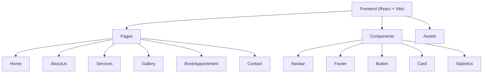

## 1. Architecture Design
Single-page React application with client-side routing.

## 2. Technology Description
- **Frontend**: React 19 + TypeScript + Vite
- **Styling**: Tailwind CSS
- **Routing**: React Router DOM
- **Animations**: Framer Motion
- **Icons**: Lucide React
- **Counters**: React CountUp
- **Forms**: React Hook Form
- **Initialization**: Vite React TypeScript template

## 3. Route Definitions
| Route | Purpose |
|-------|---------|
| / | Home Page |
| /about | About Us Page |
| /services | Services Page |
| /gallery | Gallery Page |
| /book | Book Appointment Page |
| /contact | Contact Us Page |

## 4. API Definitions (if backend exists)
No backend API required for initial version - all content is static.

## 5. Server Architecture Diagram (if backend exists)
Not applicable.

## 6. Data Model (if applicable)
Not applicable for initial static version.
