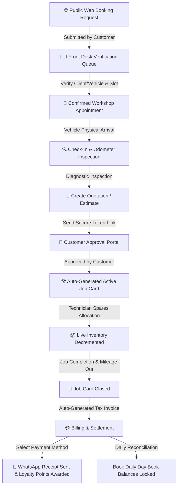

# DriveSync Garage Operations — Comprehensive End-to-End User Manual

Welcome to the **DriveSync Garage Management System User Manual**. This document details the complete end-to-end operation of the web application, highlighting role permissions, operational workflows, public web booking verification, compact audit-log interfaces, and step-by-step procedures to manage garage operations digitally.

---

## 👥 Role-Specific Access & Security Matrix

DriveSync uses a strict Role-Based Access Control (RBAC) system to ensure staff members only access components relevant to their operational duties.

| Feature / Module | Admin | Receptionist | Technician | Accountant | Customers / Public |
| :--- | :---: | :---: | :---: | :---: | :---: |
| **System Dashboard** | Full | Front-Desk | Floor-List | Finance-List | No Access |
| **Web Appointments Verification Queue** | Read/Write | Read/Write | No Access | No Access | Submit Request |
| **Customers & Vehicles Directory** | Read/Write | Read/Write | Read Only | No Access | No Access |
| **Appointments & Workshop Check-in** | Read/Write | Read/Write | Read Only | No Access | No Access |
| **Inventory & Parts Catalog** | Read/Write | Read Only | Read Only | Read/Write | No Access |
| **Record Restock / Purchases** | Read/Write | No Access | No Access | Read/Write | No Access |
| **Quotation Builder** | Read/Write | Read/Write | Read/Write | Read/Write | No Access |
| **Quotation Public Portal** | View Only | View Only | View Only | View Only | Approve / Reject |
| **Active Job Cards** | Read/Write | Read/Write | Read/Write | No Access | No Access |
| **Invoices & Credit Notes** | Read/Write | Read Only | No Access | Read/Write | No Access |
| **Record Payments & WhatsApp Receipts**| Read/Write | Read/Write | No Access | Read/Write | No Access |
| **Day Book Daily Reconciliation** | Read/Write | Read Only | No Access | Read/Write | No Access |
| **Loyalty Points Ledger & Adjustments**| Read/Write | Read/Write | No Access | Read/Write | No Access |
| **Finance Reports & Cash Flow** | Read/Write | No Access | No Access | Read/Write | No Access |
| **Staff Accounts & Attendance** | Full | Attendance Only | Attendance Only | Attendance Only | No Access |
| **System Audit Logs** | Full | No Access | No Access | No Access | No Access |
| **To-Do List & Operations Tasks** | Read/Write | Read/Write | Status Only | Read/Write | No Access |

---

## 🧭 Role-by-Role Operations Manual

### 👑 1. Administrator Guide
*   **Core Responsibilities:** Overall workshop oversight, staff account management, audit trail inspection, system configuration, inventory restock approvals, and financial reporting.
*   **Key Workflows:**
    1. **Staff Accounts & Roles:** Go to **Staff & Attendance** → Add or edit staff accounts, assign roles (`receptionist`, `technician`, `accountant`, `admin`), and monitor daily staff check-in/out timestamps.
    2. **System Audit Logs:** Go to **Audit Logs** to monitor timestamped records of every creation, edit, or deletion across appointments, job cards, inventory, and billing.
    3. **Inventory Restocking:** Approve or record new stock purchases directly linking expenditures to the Day Book and cash flow statement.
    4. **Financial Oversight:** View profit/loss summaries, revenue projections, and expense category distributions under **Finance Reports**.

### 👩‍💼 2. Front Desk & Receptionist Guide
*   **Core Responsibilities:** Managing website booking verification, client intake, vehicle check-in, quotation dispatch, job scheduling, and issuing WhatsApp payment receipts.
*   **Key Workflows:**
    1. **Web Site Appointments Queue:**
       - Navigate to **Appointments** → **New Web Bookings Queue**.
       - Review incoming client booking requests submitted from the public website.
       - Click **Verify & Create Account / Appointment**:
         - Review client details (Name, Phone, Email) and vehicle specs.
         - Verify requested appointment date/time. If the slot is occupied, pick a new available time.
         - Click **Confirm & Convert** — the system automatically registers the Customer & Vehicle profile and places the appointment into the workshop schedule.
    2. **Vehicle Intake & Odometer Inspection:**
       - When a customer arrives at the garage, locate their appointment and click **Check-In**.
       - Input current mileage, mark any pre-existing vehicle damages on the interactive diagram, upload intake photos, and assign a technician.
    3. **Quotation & Client Approval:**
       - Generate estimate quotations, change status to `Sent`, and copy the tokenized link to share via WhatsApp/SMS with the customer.
    4. **Settlement & WhatsApp Receipts:**
       - Upon job card completion, record payment (Cash, Card, ConnectIPS) and click **Send WhatsApp Receipt** to automatically launch a pre-formatted WhatsApp message to the customer's phone (`977XXXXXXXXXX`).

### 👨‍🔧 3. Floor Technician Guide
*   **Core Responsibilities:** Executing mechanical repairs, logging diagnostic findings, allocating spare parts from inventory, and updating task statuses.
*   **Key Workflows:**
    1. **Assigned Job Cards:**
       - Open **Servicing** or **Job Cards** to view active work orders assigned to you.
       - Click any compact job card row to open the full workshop floor workspace drawer.
    2. **Allocating Spares & Parts:**
       - Click **Allocate Part**, search the SKU, and enter the quantity used. Live inventory stock decrements automatically.
    3. **Work Logs & Completion:**
       - Document inspection notes (e.g., "Replaced front brake pads, bled brake fluid lines").
       - Input **Mileage Out** upon test drive completion and click **Complete & Close Job Card**.
    4. **Operations To-Do List:**
       - Open **Tasks** to view daily floor assignments. Update progress dropdowns (`Pending` → `Completed`).

### 👨‍💼 4. Accountant Guide
*   **Core Responsibilities:** Invoice management, daily Day Book balancing, manual expense logging, supplier restocking invoices, and loyalty point redemptions.
*   **Key Workflows:**
    1. **Daily Day Book Tracker:**
       - Open **Day Book** to balance daily cash and bank balances.
       - System automatically pulls opening balances, total cash/bank receipts, and cash/bank expenses to calculate expected closing balances.
       - Input actual counted cash/bank totals, enter discrepancy notes if any, and click **Lock & Close Day Book**.
    2. **Invoice Settlement & Loyalty Redemptions:**
       - Process outstanding tax invoices. If a client has accumulated loyalty points, tick **Redeem Points** to apply matching credit note discounts.
    3. **Supplier Purchase Logging:**
       - Log inventory restocking under **Inventory** → **Record Purchase**. The system automatically creates matching Outflow entries in the financial ledger.

### 🌐 5. Customer & Public Portal Guide
*   **Core Responsibilities:** Online appointment booking and digital quotation review/approval.
*   **Key Workflows:**
    1. **Online Service Booking:**
       - Visit the public homepage and click **Book Appointment**.
       - Fill in contact details, vehicle information, preferred date/time, and requested service.
       - Receive immediate confirmation while your request enters the front-desk verification queue.
    2. **Digital Quotation Sign-Off:**
       - Open the private quote link sent by the garage (`/quote-approval/...`).
       - Review line-item parts, labor costs, discounts, and VAT totals.
       - Click **Approve Estimate** and enter your digital signature to authorize repairs instantly, or click **Decline Estimate** with notes.

---

## 🚗 Modern Compact UI & Bounded Ledger Scroll Boxes

DriveSync features a unified, highly responsive design system across all management screens:

1. **Compact Audit-Log Card Layout**:
   - All listing views (**Servicing**, **Appointments**, **Invoices**, **Inventory**, **Tasks**, **Day Book**, **Loyalty**, **Notifications**, **Audit Logs**) present records as sleek, space-efficient audit cards or sticky table rows.
   - Page height remains consistent and bounded, preventing whole-website scrolling when hundreds of records accumulate.

2. **Internal Scroll Box Containers**:
   - Every list section is wrapped inside an internal fixed-height scroll container (`max-h-[calc(100vh-340px)] min-h-[350px] overflow-y-auto pr-1`).
   - Sticky headers keep column titles (`SKU`, `Description`, `Amount`, `Status`) pinned while scrolling.

3. **Click-to-Reveal Details**:
   - Clicking any compact card or table row instantly opens a slide-over drawer or modal modal displaying full history, diagnostic notes, photos, and itemized breakdowns.

4. **Standardized 25 Records Initial Fetching**:
   - All pagination ledgers fetch **25 records per page** by default to maintain fast load times and clean organization.

---

## 📊 End-to-End Operational Lifecycle Summary

---

## ⚙️ Maintenance & System Audits

- **Midnight Low Stock Sweep:** An automated cron task sweeps inventory at midnight daily, flagging items below `minQty` and sending role-targeted alerts.
- **Audit Log Accountability:** Every database mutation records user ID, IP address, action type, and JSON payload summary to ensure complete transparency across garage management operations.
